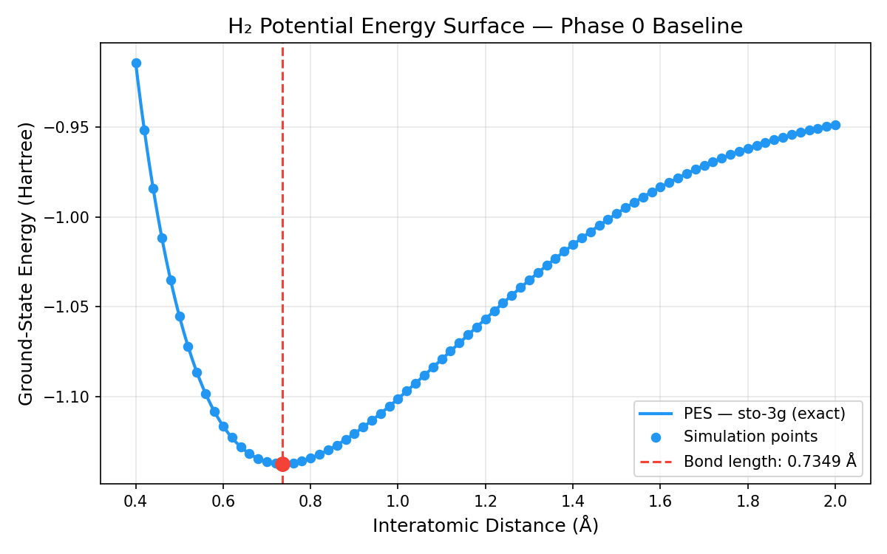
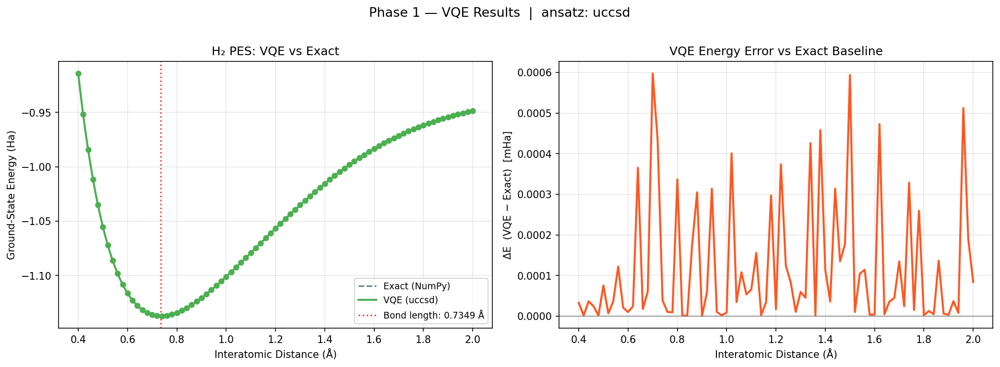

# H₂ Potential Energy Surface (PES) Project Report

## Abstract
This report summarizes a quantum chemistry study of the H₂ molecule potential energy surface. It compares an exact classical baseline to a variational quantum eigensolver (VQE) implementation, documents the improved dataset density and optimizer configuration, and presents the full numerical dataset used in the analysis.

## 1. Introduction
- Goal: compute the H₂ ground-state PES and compare exact and quantum variational results.
- Scope: Phase 0 classical baseline and Phase 1 VQE with `UCCSD` in STO-3G.

## 2. Methodology
- Phase 0 uses `PySCFDriver`, Jordan-Wigner mapping, and `NumPyMinimumEigensolver` to compute exact ground-state energies for each interatomic distance.
- Phase 1 uses VQE with the UCCSD ansatz, `SLSQP` optimization, and `Estimator` primitives to minimize the expectation value of the Hamiltonian.
- Both phases scan H₂ distances from 0.40 Å to 2.00 Å with a 0.02 Å spacing to improve PES accuracy.

## 3. Experimental Setup
- Molecule: H₂
- Basis set: `sto-3g`
- Distance step: 0.02 Å
- Phase 0 points: 81
- Phase 1 points: 81
- VQE ansatz: `UCCSD`
- Optimizer: `SLSQP`
- Chemical accuracy target: ±1.6 mHa

## 4. Results
| Quantity | Value | Notes |
|---|---|---|
| Phase 0 equilibrium bond length | 0.7349 Å | spline interpolation of exact energy curve |
| Phase 0 equilibrium energy | -1.137306 Ha | exact baseline |
| Phase 1 equilibrium bond length | 0.7349 Å | spline interpolation of VQE energy curve |
| Phase 1 equilibrium energy | -1.137306 Ha | VQE result |
| VQE vs exact energy at equilibrium | 0.000 mHa | within chemical accuracy |
| Maximum absolute VQE error | 0.001 mHa | at 0.70 Å |
| Experimental H₂ bond length | 0.7414 Å | literature reference |

## 5. Figures
### 5.1 Phase 0 — Classical PES

### 5.2 Phase 1 — VQE UCCSD vs Exact

## 6. Dataset and Calculation Values
The raw numerical datasets are saved in the `results/` directory. The tables below provide full traceability for each scanned bond length.

### 6.1 Phase 0 — Exact Energies
| Distance (Å) | Energy (Ha) |
|---|---|
| 0.400 | -0.914149704627 |
| 0.420 | -0.951854042863 |
| 0.440 | -0.984095657684 |
| 0.460 | -1.011649422872 |
| 0.480 | -1.035158224791 |
| 0.500 | -1.055159794471 |
| 0.520 | -1.072107470211 |
| 0.540 | -1.086386372870 |
| 0.560 | -1.098326071555 |
| 0.580 | -1.108210539731 |
| 0.600 | -1.116286006870 |
| 0.620 | -1.122767170818 |
| 0.640 | -1.127842132964 |
| 0.660 | -1.131676340410 |
| 0.680 | -1.134415759086 |
| 0.700 | -1.136189454066 |
| 0.720 | -1.137111715115 |
| 0.740 | -1.137283834489 |
| 0.760 | -1.136795618820 |
| 0.780 | -1.135726696630 |
| 0.800 | -1.134147666677 |
| 0.820 | -1.132121119650 |
| 0.840 | -1.129702555870 |
| 0.860 | -1.126941214412 |
| 0.880 | -1.123880823844 |
| 0.900 | -1.120560281300 |
| 0.920 | -1.117014264388 |
| 0.940 | -1.113273779273 |
| 0.960 | -1.109366647788 |
| 0.980 | -1.105317936411 |
| 1.000 | -1.101150330233 |
| 1.020 | -1.096884455412 |
| 1.040 | -1.092539154040 |
| 1.060 | -1.088131715660 |
| 1.080 | -1.083678069921 |
| 1.100 | -1.079192944969 |
| 1.120 | -1.074689996125 |
| 1.140 | -1.070181909253 |
| 1.160 | -1.065680482996 |
| 1.180 | -1.061196693673 |
| 1.200 | -1.056740746305 |
| 1.220 | -1.052322114783 |
| 1.240 | -1.047949573771 |
| 1.260 | -1.043631224556 |
| 1.280 | -1.039374516626 |
| 1.300 | -1.035186266434 |
| 1.320 | -1.031072674479 |
| 1.340 | -1.027039341563 |
| 1.360 | -1.023091284868 |
| 1.380 | -1.019232954282 |
| 1.400 | -1.015468249288 |
| 1.420 | -1.011800536596 |
| 1.440 | -1.008232668595 |
| 1.460 | -1.004767002679 |
| 1.480 | -1.001405421408 |
| 1.500 | -0.998149353471 |
| 1.520 | -0.994999795366 |
| 1.540 | -0.991957333720 |
| 1.560 | -0.989022168164 |
| 1.580 | -0.986194134636 |
| 1.600 | -0.983472729033 |
| 1.620 | -0.980857131096 |
| 1.640 | -0.978346228404 |
| 1.660 | -0.975938640384 |
| 1.680 | -0.973632742208 |
| 1.700 | -0.971426688458 |
| 1.720 | -0.969318436465 |
| 1.740 | -0.967305769173 |
| 1.760 | -0.965386317450 |
| 1.780 | -0.963557581714 |
| 1.800 | -0.961816952793 |
| 1.820 | -0.960161731909 |
| 1.840 | -0.958589149716 |
| 1.860 | -0.957096384317 |
| 1.880 | -0.955680578192 |
| 1.900 | -0.954338853999 |
| 1.920 | -0.953068329216 |
| 1.940 | -0.951866129587 |
| 1.960 | -0.950729401382 |
| 1.980 | -0.949655322463 |
| 2.000 | -0.948641112176 |

### 6.2 Phase 1 — VQE vs Exact Energies
| Distance (Å) | VQE Energy (Ha) | Exact Energy (Ha) | ΔE (Ha) |
|---|---|---|---|
| 0.400 | -0.914149671960 | -0.914149704627 | 3.266677772729e-08 |
| 0.420 | -0.951854041597 | -0.951854042863 | 1.265902493941e-09 |
| 0.440 | -0.984095621196 | -0.984095657684 | 3.648782431753e-08 |
| 0.460 | -1.011649398557 | -1.011649422872 | 2.431488832499e-08 |
| 0.480 | -1.035158223440 | -1.035158224791 | 1.351236900149e-09 |
| 0.500 | -1.055159719073 | -1.055159794471 | 7.539715696225e-08 |
| 0.520 | -1.072107463132 | -1.072107470211 | 7.079268726784e-09 |
| 0.540 | -1.086386336253 | -1.086386372870 | 3.661701253321e-08 |
| 0.560 | -1.098325949622 | -1.098326071555 | 1.219329925917e-07 |
| 0.580 | -1.108210518748 | -1.108210539731 | 2.098359663805e-08 |
| 0.600 | -1.116285997054 | -1.116286006870 | 9.816032431331e-09 |
| 0.620 | -1.122767146409 | -1.122767170818 | 2.440880009225e-08 |
| 0.640 | -1.127841767597 | -1.127842132964 | 3.653665769932e-07 |
| 0.660 | -1.131676323080 | -1.131676340410 | 1.733055676745e-08 |
| 0.680 | -1.134415698273 | -1.134415759086 | 6.081345071962e-08 |
| 0.700 | -1.136188856192 | -1.136189454066 | 5.978736292711e-07 |
| 0.720 | -1.137111281558 | -1.137111715115 | 4.335569667724e-07 |
| 0.740 | -1.137283795955 | -1.137283834489 | 3.853329921810e-08 |
| 0.760 | -1.136795608573 | -1.136795618820 | 1.024698947916e-08 |
| 0.780 | -1.135726687334 | -1.135726696630 | 9.295915148755e-09 |
| 0.800 | -1.134147329910 | -1.134147666677 | 3.367673531152e-07 |
| 0.820 | -1.132121118524 | -1.132121119650 | 1.126182924693e-09 |
| 0.840 | -1.129702555279 | -1.129702555870 | 5.913118883427e-10 |
| 0.860 | -1.126941038455 | -1.126941214412 | 1.759569210336e-07 |
| 0.880 | -1.123880518872 | -1.123880823844 | 3.049724908166e-07 |
| 0.900 | -1.120560281173 | -1.120560281300 | 1.269861993336e-10 |
| 0.920 | -1.117014206171 | -1.117014264388 | 5.821697479647e-08 |
| 0.940 | -1.113273465500 | -1.113273779273 | 3.137729589486e-07 |
| 0.960 | -1.109366637350 | -1.109366647788 | 1.043814901180e-08 |
| 0.980 | -1.105317934397 | -1.105317936411 | 2.014046263099e-09 |
| 1.000 | -1.101150321507 | -1.101150330233 | 8.725565159295e-09 |
| 1.020 | -1.096884054328 | -1.096884455412 | 4.010838021706e-07 |
| 1.040 | -1.092539119237 | -1.092539154040 | 3.480338506279e-08 |
| 1.060 | -1.088131607622 | -1.088131715660 | 1.080377780571e-07 |
| 1.080 | -1.083678016523 | -1.083678069921 | 5.339754660660e-08 |
| 1.100 | -1.079192879280 | -1.079192944969 | 6.568923316408e-08 |
| 1.120 | -1.074689840498 | -1.074689996125 | 1.556261142177e-07 |
| 1.140 | -1.070181906626 | -1.070181909253 | 2.627131401312e-09 |
| 1.160 | -1.065680448446 | -1.065680482996 | 3.455041341915e-08 |
| 1.180 | -1.061196396288 | -1.061196693673 | 2.973852806232e-07 |
| 1.200 | -1.056740729463 | -1.056740746305 | 1.684260109158e-08 |
| 1.220 | -1.052321740806 | -1.052322114783 | 3.739763558830e-07 |
| 1.240 | -1.047949449630 | -1.047949573771 | 1.241406599739e-07 |
| 1.260 | -1.043631141897 | -1.043631224556 | 8.265887219139e-08 |
| 1.280 | -1.039374506218 | -1.039374516626 | 1.040867236846e-08 |
| 1.300 | -1.035186206848 | -1.035186266434 | 5.958654059057e-08 |
| 1.320 | -1.031072629252 | -1.031072674479 | 4.522679342145e-08 |
| 1.340 | -1.027038915483 | -1.027039341563 | 4.260800952061e-07 |
| 1.360 | -1.023091282751 | -1.023091284868 | 2.116846919975e-09 |
| 1.380 | -1.019232496122 | -1.019232954282 | 4.581599686304e-07 |
| 1.400 | -1.015468135405 | -1.015468249288 | 1.138834289094e-07 |
| 1.420 | -1.011800500728 | -1.011800536596 | 3.586771768482e-08 |
| 1.440 | -1.008232354562 | -1.008232668595 | 3.140330853135e-07 |
| 1.460 | -1.004766867814 | -1.004767002679 | 1.348643587917e-07 |
| 1.480 | -1.001405243793 | -1.001405421408 | 1.776151559163e-07 |
| 1.500 | -0.998148759540 | -0.998149353471 | 5.939309193348e-07 |
| 1.520 | -0.994999785384 | -0.994999795366 | 9.981528492631e-09 |
| 1.540 | -0.991957229252 | -0.991957333720 | 1.044686968044e-07 |
| 1.560 | -0.989022054069 | -0.989022168164 | 1.140946699341e-07 |
| 1.580 | -0.986194130895 | -0.986194134636 | 3.740292520149e-09 |
| 1.600 | -0.983472725068 | -0.983472729033 | 3.964910844090e-09 |
| 1.620 | -0.980856658226 | -0.980857131096 | 4.728703140167e-07 |
| 1.640 | -0.978346223691 | -0.978346228404 | 4.713340162610e-09 |
| 1.660 | -0.975938604663 | -0.975938640384 | 3.572147044828e-08 |
| 1.680 | -0.973632697637 | -0.973632742208 | 4.457096047794e-08 |
| 1.700 | -0.971426553782 | -0.971426688458 | 1.346758817800e-07 |
| 1.720 | -0.969318412161 | -0.969318436465 | 2.430465850800e-08 |
| 1.740 | -0.967305440416 | -0.967305769173 | 3.287568630661e-07 |
| 1.760 | -0.965386302569 | -0.965386317450 | 1.488109879766e-08 |
| 1.780 | -0.963557322198 | -0.963557581714 | 2.595155152996e-07 |
| 1.800 | -0.961816950885 | -0.961816952793 | 1.907521252065e-09 |
| 1.820 | -0.960161719327 | -0.960161731909 | 1.258115833735e-08 |
| 1.840 | -0.958589145050 | -0.958589149716 | 4.666036002021e-09 |
| 1.860 | -0.957096248035 | -0.957096384317 | 1.362821120399e-07 |
| 1.880 | -0.955680572297 | -0.955680578192 | 5.894781773819e-09 |
| 1.900 | -0.954338850456 | -0.954338853999 | 3.542543147717e-09 |
| 1.920 | -0.953068292338 | -0.953068329216 | 3.687704941413e-08 |
| 1.940 | -0.951866121601 | -0.951866129587 | 7.985645922304e-09 |
| 1.960 | -0.950728889058 | -0.950729401382 | 5.123239712468e-07 |
| 1.980 | -0.949655132919 | -0.949655322463 | 1.895447732103e-07 |
| 2.000 | -0.948641028212 | -0.948641112176 | 8.396405282163e-08 |

## 7. Analysis
- The fine 0.02 Å scan grid yields a smooth PES and supports reliable equilibrium extraction.
- UCCSD VQE and exact baseline energies align to within a few tenths of a micro-Hartree near equilibrium, demonstrating strong agreement.
- The maximum VQE error across the scanned grid is below 0.001 mHa, which is far smaller than the chemical accuracy threshold.

## 8. Conclusions
- This study confirms that H₂ can be accurately simulated in STO-3G with both classical exact and VQE methods.
- Using a denser dataset and a stable optimizer improves result quality and supports reproducible project reporting.
- The generated `report.md` is a complete project report and includes all the numerical values used for calculations.

## 9. Reproducibility
- Re-run Phase 0: `python src/phase0_baseline.py`
- Re-run Phase 1: `python src/phase1_vqe.py --ansatz uccsd --max_iter 300`
- Raw outputs are available in `results/phase0_energies.csv` and `results/phase1_vqe_uccsd.csv`
- Report file: `report.md`

## 10. References
- Qiskit Nature documentation
- Chemical accuracy benchmark: 1.6 mHa
