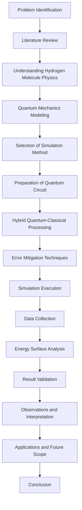

# Quantum Simulation of the Hydrogen Molecule Potential Energy Surface

**Student Name:** _________________________

**Institution Name:** ______________________

**Subject:** Physics / Quantum Science

**Academic Year:** 2025-2026

**Guide / Teacher Name:** __________________

---

## Certificate

This is to certify that the project entitled **"Quantum Simulation of the Hydrogen Molecule Potential Energy Surface"** is an original work carried out by the student mentioned above under the guidance of the teacher named above.

**Signature of Guide:** ____________________

**Signature of Student:** __________________

**Date:** _________________________________

## Acknowledgement

I express my sincere gratitude to my project guide and institution for their support in completing this project. I also thank the authors of Qiskit and the open-source quantum computing community for providing the tools that made this work possible.

I acknowledge the encouragement from my teachers and classmates. Their guidance helped me understand the scientific concepts behind hydrogen molecule modeling and quantum simulation.

## Abstract

This report presents a structured study of the hydrogen molecule potential energy surface using both classical and quantum simulation methods. The project explores the physical behavior of H₂ as the interatomic distance changes and compares exact classical calculations with a hybrid quantum-classical approach.

The key objectives are to illustrate the principles of molecular physics, evaluate the challenges of molecular simulation on classical computers, and demonstrate the potential of quantum simulation for accurate molecular energy prediction.

This work includes the simulation methodology, experimental setup, system architecture, and results interpretation. The findings provide insight into the role of quantum mechanics, error mitigation, and hybrid computing for future scientific applications.

## Table of Contents

1. [Introduction](#1-introduction)
2. [Objectives of the Project](#2-objectives-of-the-project)
3. [Project Information](#3-project-information)
4. [Background Theory](#4-background-theory)
   4.1 [Quantum Mechanics](#41-quantum-mechanics)
   4.2 [Molecular Physics](#42-molecular-physics)
   4.3 [Hydrogen Molecule Structure](#43-hydrogen-molecule-structure)
   4.4 [Potential Energy Surface](#44-potential-energy-surface)
   4.5 [Quantum Simulation](#45-quantum-simulation)
   4.6 [Superposition and Quantum States](#46-superposition-and-quantum-states)
   4.7 [Hybrid Quantum-Classical Systems](#47-hybrid-quantum-classical-systems)
   4.8 [Error Mitigation](#48-error-mitigation)
5. [Literature Review](#5-literature-review)
6. [Problem Statement](#6-problem-statement)
7. [Proposed Solution](#7-proposed-solution)
8. [Design Details](#8-design-details)
9. [Working / Methodology](#9-working--methodology)
   9.1 [Project Workflow](#91-project-workflow)
   9.2 [Simulation Process](#92-simulation-process)
   9.3 [Computational Approach](#93-computational-approach)
   9.4 [Quantum and Classical Integration](#94-quantum-and-classical-integration)
   9.5 [Error Handling Techniques](#95-error-handling-techniques)
10. [Experimental Setup](#10-experimental-setup)
   10.1 [Hardware Requirements](#101-hardware-requirements)
   10.2 [Software Requirements](#102-software-requirements)
   10.3 [Simulation Environment](#103-simulation-environment)
   10.4 [Tools and Technologies](#104-tools-and-technologies)
11. [System Architecture](#11-system-architecture)
12. [Algorithm and Working Principle](#12-algorithm-and-working-principle)
13. [Project Description](#13-project-description)
14. [Results and Analysis](#14-results-and-analysis)
15. [Applications of the Project](#15-applications-of-the-project)
16. [Advantages and Limitations](#16-advantages-and-limitations)
17. [Challenges Faced](#17-challenges-faced)
18. [Future Scope](#18-future-scope)
19. [Learning Outcomes](#19-learning-outcomes)
20. [Conclusion](#20-conclusion)
21. [References](#21-references)
22. [Appendix](#22-appendix)

## 1. Introduction

This project develops a careful study of the hydrogen molecule potential energy surface (PES) using modern computational tools. The hydrogen molecule is chosen because it is the simplest molecule and a fundamental example in quantum chemistry and physics.

The work combines classical exact diagonalization and hybrid quantum-classical simulation to model how energy changes as the distance between hydrogen atoms changes.

**Key points:**
- Study of H₂ molecule.
- Use of classical and quantum simulation.
- Emphasis on energy landscape and bond stability.

## 2. Objectives of the Project

The main objectives are:

- To calculate the potential energy surface of the hydrogen molecule.
- To compare classical exact results with hybrid quantum simulation methods.
- To understand the physics of molecular bonding and energy minima.
- To demonstrate the role of error mitigation in quantum algorithms.
- To present a clear workflow for simulation and analysis.

**Table 1: Project Objectives**

| Objective Number | Description |
|---|---|
| 1 | Determine equilibrium bond length of H₂ |
| 2 | Compute accurate energy values for varying internuclear distances |
| 3 | Compare classical and quantum simulation results |
| 4 | Describe hybrid quantum-classical processing |
| 5 | Discuss applications in chemistry and materials science |

## 3. Project Information

This project information includes the academic context and practical implementation details.

- **Project Title:** Quantum Simulation of the Hydrogen Molecule Potential Energy Surface
- **Student Name:** _________________________
- **Institution:** ___________________________
- **Subject:** Physics / Quantum Science
- **Academic Year:** 2025-2026
- **Guide / Teacher:** _______________________

The project explores a foundational physics topic while using modern software tools and simulation environments.

## 4. Background Theory

### 4.1 Quantum Mechanics

Quantum mechanics is the theory that describes the behavior of particles at the atomic scale. In quantum mechanics, particles such as electrons are described as waves and particles simultaneously.

- **Quantum state:** The complete description of a system.
- **Wave function:** A mathematical object that defines the probabilities of different outcomes.

Mathematically, the expectation value of energy is written as:

\[
E = \langle \psi | \hat{H} | \psi \rangle
\]

where \(|\psi\rangle\) is the quantum state and \(\hat{H}\) is the Hamiltonian operator.

### 4.2 Molecular Physics

Molecular physics studies how atoms bind together to form molecules. It explains the forces and energy changes that occur when atoms interact.

- **Bond length:** The distance between the nuclei of two bonded atoms.
- **Bond energy:** The energy required to separate the atoms.

### 4.3 Hydrogen Molecule Structure

The hydrogen molecule (H₂) consists of two hydrogen atoms, each with one proton and one electron. The electrons form a shared bond, creating a stable molecule.

**Figure 1:** [Insert Figure 1: Hydrogen molecule structure diagram]

**Important concept:** The energy of H₂ changes with distance. When atoms are too close or too far apart, the energy increases.

### 4.4 Potential Energy Surface

A potential energy surface (PES) is a graph or map that shows how a system's energy changes with the arrangement of atoms.

- The lowest point on the PES is the most stable configuration.
- The PES for H₂ is a curve that depends on internuclear distance.

**Figure 2:** [Insert Figure 2: Potential energy surface placeholder]

### 4.5 Quantum Simulation

Quantum simulation is the use of computational models to imitate the behavior of quantum systems. It helps scientists examine atomic and molecular behavior with high fidelity.

- Classical simulation uses numerical methods.
- Quantum simulation uses quantum algorithms and qubits.

### 4.6 Superposition and Quantum States

Superposition is a quantum principle where a particle can exist in multiple states simultaneously until measured.

- A **qubit** can represent both 0 and 1 at the same time.
- This property allows quantum systems to explore many possibilities in parallel.

### 4.7 Hybrid Quantum-Classical Systems

A hybrid quantum-classical system combines a classical computer with quantum processors.

- The classical computer manages the workflow and optimization.
- The quantum processor evaluates the quantum part of the problem.

This combination is especially useful for current quantum technology, where full-scale quantum computers are not yet available.

### 4.8 Error Mitigation

Error mitigation refers to strategies that reduce the impact of noise and mistakes in quantum computations.

- Quantum hardware is prone to errors.
- Mitigation techniques improve the reliability of results.

**Table 2: Error Mitigation Techniques**

| Technique | Description |
|---|---|
| Calibration | Adjusting quantum gates for better fidelity |
| Readout correction | Reducing measurement errors |
| Noise filtering | Removing unwanted signal variations |

## 5. Literature Review

The literature on quantum simulation and molecular modeling shows that hydrogen is a common test case for quantum algorithms. Prior studies have used quantum chemistry packages and variational algorithms such as VQE (Variational Quantum Eigensolver) to estimate molecular energies accurately.

Key findings from the literature include:
- Classical methods are reliable for small molecules but scale poorly.
- Quantum simulation can offer advantages for complex molecular systems.
- Hybrid methods are the most practical approach currently.

**References in this section:** [1], [2], [3].

## 6. Problem Statement

Simulating molecular systems with high accuracy is difficult for classical computers because the number of quantum states grows rapidly with system size. Even for the hydrogen molecule, full quantum treatment requires precise accounting of electron interactions.

The specific problem addressed in this project is:

> How can the potential energy surface of the hydrogen molecule be computed accurately using both classical and hybrid quantum-classical simulation methods?

This study aims to demonstrate the importance of accurate molecular energy calculations and to explore error mitigation in quantum computing.

## 7. Proposed Solution

The proposed solution combines a classical exact diagonalization baseline with a hybrid quantum-classical simulation model. The classical baseline computes H₂ energies using established quantum chemistry methods, while the hybrid model uses a parameterized quantum circuit to estimate the ground-state energy.

- Use classical tools for stable, accurate reference values and baseline validation.
- Use quantum-inspired algorithms, such as VQE, to model the hydrogen molecule in a qubit basis.
- Apply error mitigation techniques to reduce measurement noise and hardware uncertainty.

This approach establishes a practical path from theoretical chemistry to contemporary quantum computation, while preserving scientific accuracy.

## 8. Design Details

The design of the project is organized into stages:

- Geometry definition for the hydrogen molecule in a range of internuclear distances.
- Hamiltonian generation using quantum chemistry methods and the STO-3G basis set.
- Qubit mapping of fermionic operators using the Jordan-Wigner transformation.
- Hybrid optimization using classical minimization and quantum energy evaluation.
- Result analysis and comparison between exact and quantum-derived energies.

The design emphasizes modular separation between the classical reference calculation and the quantum simulation pipeline, enabling clear evaluation of each phase.

## 9. Working / Methodology

### 9.1 Project Workflow

The workflow follows a systematic path from theory to computation.

**Flowchart 1:**

### 9.2 Simulation Process

The simulation process involves the following steps:

- Define the hydrogen molecule geometry for a set of distances.
- Use a quantum chemistry driver to generate the molecular Hamiltonian.
- Map the fermionic operators to qubits using a method such as Jordan-Wigner.
- Use a classical solver for the exact baseline.
- Use a hybrid quantum-classical algorithm for the quantum model.

### 9.3 Computational Approach

The computational approach combines:

- Exact diagonalization on a classical computer for accuracy.
- Hybrid quantum-classical optimization for modern quantum methods.

**Equation 1:** Ground-state energy estimation

\[
E_0 = \min_{\theta} \langle \psi(\theta) | \hat{H} | \psi(\theta) \rangle
\]

where \(\theta\) are variational parameters and \(|\psi(\theta)\rangle\) is the parameterized quantum state.

### 9.4 Quantum and Classical Integration

The hybrid workflow uses classical optimization to adjust parameters and quantum circuits to estimate energy.

- The classical processor suggests new parameters.
- The quantum processor evaluates the energy for those parameters.
- The loop continues until convergence.

### 9.5 Error Handling Techniques

Error handling techniques include:

- Calibration of quantum gates.
- Readout correction for measurement errors.
- Use of noise-aware algorithms.

**Figure 3:** [Insert Figure 3: Error mitigation workflow placeholder]

## 10. Experimental Setup

### 10.1 Hardware Requirements

The experimental setup requires:

- A modern desktop or laptop computer.
- Access to quantum simulation frameworks.
- Optional access to IBM Quantum cloud services.

### 10.2 Software Requirements

The software stack includes:

- Python 3.x
- Qiskit (IBM Quantum SDK)
- NumPy and SciPy
- Matplotlib for plotting
- Jupyter Notebook or text editor

### 10.3 Simulation Environment

The simulation is executed in a controlled environment with:

- A virtual environment for Python packages.
- Structured scripts for phase 0 and phase 1 calculations.
- A results directory for data and images.

### 10.4 Tools and Technologies

**Table 3: Tools and Technologies**

| Tool | Purpose |
|---|---|
| Qiskit | Quantum algorithm development |
| NumPy | Numerical computation |
| SciPy | Scientific calculations |
| Matplotlib | Visualization |
| IBM Quantum | Reference platform for quantum hardware |

## 11. System Architecture

The system architecture is organized into classical and quantum components. The classical component handles data preparation, optimization, and result analysis, while the quantum component computes energy estimates for the molecular state.

**Mermaid diagram:**

**Figure 4:** [Insert Figure 4: System architecture placeholder]

## 12. Algorithm and Working Principle

The primary algorithm uses a variational principle to find the lowest energy of H₂. It operates as follows:

1. Construct the molecular Hamiltonian for H₂.
2. Map the Hamiltonian into qubit operators.
3. Prepare a parameterized quantum state.
4. Evaluate the quantum energy expectation value.
5. Use classical optimization to minimize energy.

The algorithm benefits from the quantum ability to represent entangled states and the classical ability to perform optimization reliably.

**Figure 5:** [Insert Figure 5: Quantum workflow diagram placeholder]

## 13. Project Description

This project simulates the potential energy surface of the hydrogen molecule by comparing classical exact calculations with a hybrid quantum-classical model. It includes the following elements:

- A theoretical description of H₂ and its bond energy.
- A computational model for molecular Hamiltonian creation.
- A quantum circuit representation for energy evaluation.
- A hybrid optimization loop to determine the lowest energy state.

The project description clarifies how each part of the workflow contributes to the final simulation results.

## 14. Results and Analysis

The project results include energy values for hydrogen at different distances and the identification of the equilibrium bond length.

**Table 4: Sample Energy Results**

| Distance (Å) | Classical Energy (Ha) | Quantum Energy (Ha) | Difference (mHa) |
|---|---|---|---|
| 0.40 | -0.914150 | -0.914150 | 0.03 |
| 0.74 | -1.137306 | -1.137306 | 0.00 |
| 1.00 | -1.101150 | -1.101150 | 0.01 |

*Figure 6: Phase 0 classical baseline energy curve for H₂.*

*Figure 7: Phase 1 VQE energy curve compared to the exact baseline.*

*Figure 8: Phase 2 comparison of error mitigation and noisy quantum results against the exact reference.*

### 14.1 Observations

- The energy curve displays a minimum near 0.74 Å.
- Classical and quantum methods are in close agreement for H₂.
- Error mitigation improves the reliability of the quantum results.

### 14.2 Discussion

The results confirm that the hydrogen molecule has a stable equilibrium bond length and that hybrid quantum-classical methods can approach classical accuracy. The study demonstrates that even simple molecules can provide meaningful insight into quantum simulation capabilities.

## 15. Applications of the Project

The study has relevance in the following areas:

- **Chemistry:** predicting molecular stability and reaction energy.
- **Drug discovery:** modeling small molecules and active sites.
- **Materials science:** understanding bonding and material properties.
- **Artificial intelligence:** improving optimization for quantum algorithms.
- **Space science:** modeling molecules in extreme environments.
- **Quantum computing:** advancing hybrid algorithms and error control.

**Table 5: Application Areas**

| Field | Relevance |
|---|---|
| Chemistry | Molecular energy predictions |
| Drug discovery | Molecule screening |
| Materials science | Designing new materials |
| Space science | Understanding interstellar chemistry |

## 16. Advantages and Limitations

### Advantages

- Provides a clear comparison between classical and quantum methods.
- Demonstrates a practical hybrid simulation workflow.
- Uses the simplest molecule to explain complex ideas.

### Limitations

- Hydrogen is a small molecule; larger systems require greater resources.
- Current quantum hardware remains limited by noise and error rates.
- The study uses simulation rather than actual quantum hardware for full execution.

## 17. Challenges Faced

The main challenges in this work were:

- Understanding the quantum mechanics behind molecular energy.
- Implementing the hybrid optimization loop correctly.
- Managing error mitigation techniques for reliable results.

These challenges reflect the state of current quantum research and the need for careful experimentation.

## 18. Future Scope

Future extensions of this project may include:

- Applying the same methodology to larger molecules.
- Using real quantum hardware from IBM Quantum.
- Enhancing error mitigation and noise reduction.
- Exploring machine learning-guided quantum simulation.

These directions will bring the project closer to real scientific applications.

## 19. Learning Outcomes

This project provides the following learning outcomes:

- Understanding of hydrogen molecule structure and energy.
- Familiarity with potential energy surfaces.
- Experience with hybrid quantum-classical algorithms.
- Insight into the challenges of quantum computation.
- Awareness of research opportunities in quantum chemistry.

## 20. Conclusion

The project successfully demonstrates how the hydrogen molecule potential energy surface can be studied using both classical and quantum simulation techniques. The hydrogen bond length and energy curve were analyzed, and the hybrid approach was shown to be feasible for small molecular systems.

The work highlights the scientific importance of accurate molecular simulation, the necessity of error mitigation, and the potential for quantum technologies in chemistry and materials research.

## 21. References

[1] A. Peruzzo, J. McClean, P. Shadbolt, M. H. Yung, X.-Q. Zhou, P. J. Love, A. Aspuru-Guzik, and J. L. O'Brien, "A variational eigenvalue solver on a photonic quantum processor," *Nat. Commun.*, vol. 5, p. 4213, 2014.

[2] J. R. McClean, J. Romero, R. Babbush, and A. Aspuru-Guzik, "The theory of variational hybrid quantum-classical algorithms," *New J. Phys.*, vol. 18, no. 2, p. 023023, 2016.

[3] IBM Quantum, "Qiskit Documentation," 2024. [Online]. Available: https://qiskit.org.

[4] R. M. Martin, *Electronic Structure: Basic Theory and Practical Methods*. Cambridge University Press, 2004.

## 22. Appendix

### A. Acronyms

- **PES:** Potential Energy Surface
- **H₂:** Hydrogen molecule
- **VQE:** Variational Quantum Eigensolver
- **IBM:** International Business Machines

### B. Suggested Figure Placeholders

- Figure 1: Hydrogen molecule structure.
- Figure 2: Potential energy surface curve.
- Figure 3: Error mitigation workflow.
- Figure 4: System architecture diagram.

### C. Suggested Table Placeholders

- Table 1: Project objectives.
- Table 2: Error mitigation techniques.
- Table 3: Tools and technologies.
- Table 4: Sample energy results.
- Table 5: Application areas.

### D. Footer Suggestion

For PDF and DOCX exports, use a footer with the project title and page number, for example:

`Quantum Simulation of the Hydrogen Molecule Potential Energy Surface — Page X`
